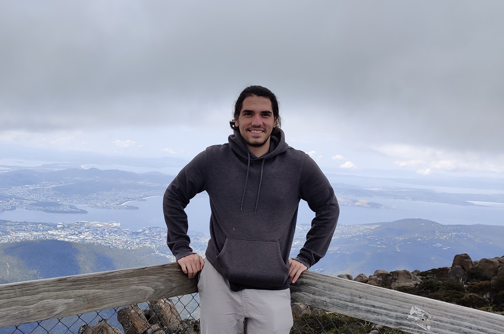

I am currently in my fifth year at the University of Queensland, in my Honours year in the Bachelor of Advanced Science with a major in Physics. I have an interest in theoretical physics and am doing my Honours project with Dr. Benjamin Roberts in theoretical atomic physics. I have also been a tutor at the University of Queensland for over two years now and have found it almost as equally challenging and enjoyable as my degree itself! 

### Research

My Honours project looks at including relativistic effects into high-accuracy theoretical atomic structure calculations. More specifically, I have been looking at including relativistic corrections to the typical electron-electron interaction, the leading order correction to which is known as the Breit interaction, into a high accuracy method for calculating the properties of atoms that uses Feynman diagrams known as the [all-orders correlation potential method](https://doi.org/10.1016/0375-9601(88)90302-7). My Honours thesis can be found [here](./Honours_thesis.pdf), and we are currently preparing a paper based on the work I completed in my project.

### Tutoring

I have been tutoring since my third year of study and have tutored a wide variety of courses across the School of Mathematics and Physics. Among the courses I have tutored are 
* MATH1052 (Multivariate Calculus & Ordinary Differential Equations),
* MATH2001 (Calculus & Linear Algebra II),
* PHYS2020 (Thermodynamics and Condensed Matter Physics),
* PHYS2041 (Quantum Mechanics I),
* PHYS3020 (Statistical Mechanics), and
* PHYS3051 (Fields in Physics II). 

<a/>
I've found tutoring to be incredibly rewarding in terms of improving my own understanding of maths and physics concepts, but also incredibly satisfying when can I help a student out on a topic that I know I found really challenging when I first encountered it as a student. My own experience taking maths and physics courses at university has been that in a lot of cases, a lot more learning will happen in tutorials than in lectures, and so I try to teach students in the way that I always found worked best for myself when I was still learning. Even though I don't know where I will end up in terms of the field of physics I go into, teaching is something that I always want to continue doing.

